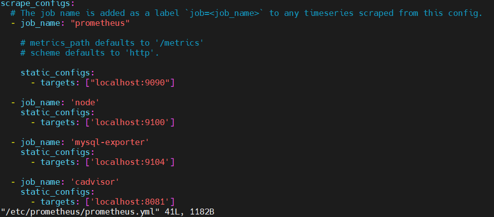
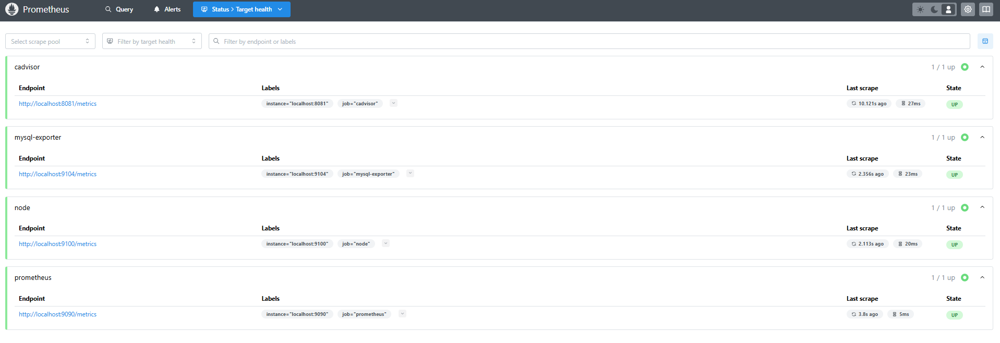

# Exporter_Monitoring
CPU utilization and System Load testing on UbuntuOS

## 1. Prometheus와 Grafana 기반의 모니터링 시스템 구축
* 목표 : 

## 2. 환경 구성

### 2-1. 아키텍처

### 2-2. 구축 환경

> * OS : Ubuntu24.04.02 <br/>
> * Software : VMware WorkStation Pro, VirtualBox <br/>
> * Tools : Prometeus 1.23.6, Docker 28.0.4, sysbench <br/>
> * Monitoring : Node Exporter, MySQL Exporter, grafana-server 11.6.0, cAdvisor 0.52.1

## 3. 수행 과정

### 3-1. Exporter 서버의 가용성을 위한 systemd 서비스 등록

1️⃣ `systemd` 서비스 유닛 파일 생성

- `/etc/systemd/system/mysqld_exporter.service` 파일을 생성한다.

```ini
[Unit]
Description=MySQL Exporter for Prometheus
After=network.target

[Service]
User=ubuntu
Group=ubuntu
Type=simple
ExecStart=/usr/local/bin/mysqld_exporter \
  --config.my-cnf=/home/ubuntu/.my.cnf \
  --web.listen-address=:9104
Restart=always

[Install]
WantedBy=multi-user.target
```

- MySQL의 Exporter를 서비스로 등록해주기 위한 파일이다.

2️⃣ `.my.cnf` 파일 생성

```ini
[client]
user=user01
password=your_password
```

- MySQL 클라이언트 설정 파일로, 해당 파일을 통해 MySQL 접속 정보를 미리 설정해두면 매번 명령어에 -u, -p 등을 입력하지 않아도 접속 가능하다.


3️⃣ systemd 서비스 적용

```bash
sudo systemctl daemon-reload
sudo systemctl enable mysqld_exporter
sudo systemctl start mysqld_exporter
sudo systemctl status mysqld_exporter
```

4️⃣ Prometheus 설정 파일 등록

- `/etc/prometheus/prometheus.yaml` 파일을 등록



5️⃣ 1~4번을 통해 cAdvisor 또한 동일한 과정을 통해서 서비스 실행에 등록한다.

6️⃣ Prometheus에서 등록 확인




### 3-2. Stress Test를 통한 실시간 부하 모니터링

🚩 **목표 1** : Stress 라이브러리를 활용하여 Spring Application에 부하 테스트 실행하기


🚩 **목표 2** : sysbench stress tool를 활용하여 MySQL 서버에 부하 테스트 실행